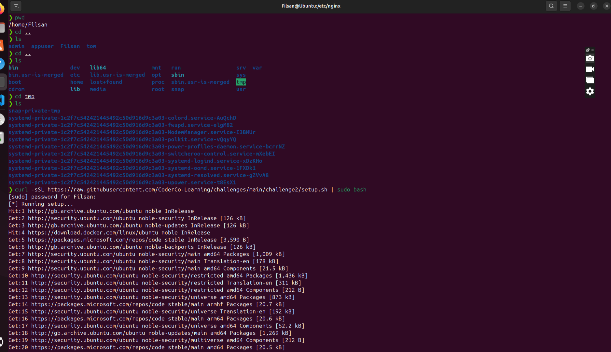

# Download the setup script and run it:

`curl -sSL https://raw.githubusercontent.com/CoderCo-Learning/challenges/main/challenge2/setup.sh | sudo bash`

## Task Fix Nginx

## Step 1

 

 

## Step 2

## Step 3

## Step 4

## Step 5

## Step 6

## Step 7

## Step 8

## Step 9

## Step 10

## Step 11

## Step 12

## Step 13

## Step 14

## Step 15

## Step 16

## Step 17

## Step 18

## Step 19

## Step 20

## Step 21

## Step 22

## Step 23

## Step 24

## Step 25

## Step 26

## Step 27

## Step 28

## Step 29

## Step 30

## Step 31

## Step 32

## Step 33

## Step 34

## Step 35

## Step 36

## Step 37

## Step 38

## Step 39
