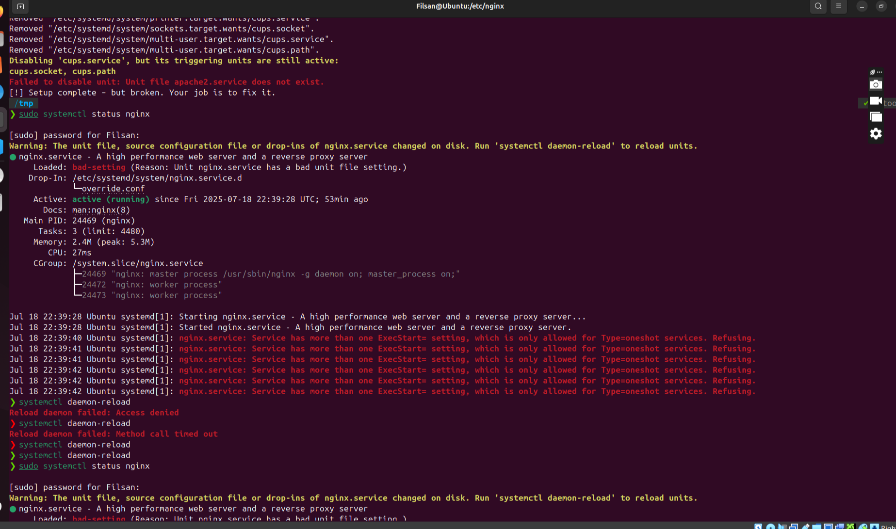
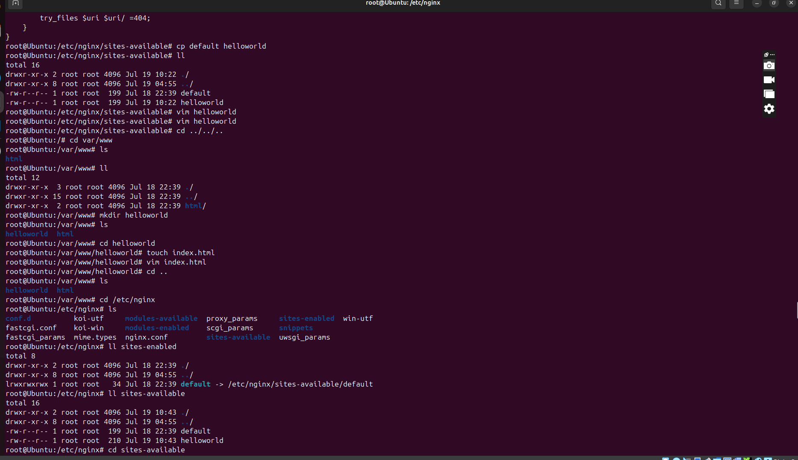

# Download the setup script and run it:

`curl -sSL https://raw.githubusercontent.com/CoderCo-Learning/challenges/main/challenge2/setup.sh | sudo bash`

## Task Fix Nginx

## Step 1

 

 

## Step 2

 

 

## Step 3

 

 

## Step 4

 

 

## Step 5

 

 

## Step 6

 

 

## Step 7

 

 

## Step 8

 

 

## Step 9

 

 

## Step 10

 

 

## Step 11

 

 

## Step 12

 

 

## Step 13

 

 

## Step 14

 

 

## Step 15

 

 

## Step 16

 

 

## Step 17

 

 

## Step 18

 

 

## Step 19

 

 

## Step 20

 

 

## Step 21

 

 

## Step 22

 

 

## Step 23

 

 

## Step 24

 

 

## Step 25

 

 

## Step 26

 

 

## Step 27

 

 

## Step 28

 

 

## Step 29

 

 

## Step 30

 

 

## Step 31

 

 

## Step 32

 

 

## Step 33

 

 

## Step 34

 

 

## Step 35

 

 

## Step 36

 

 

## Step 37

 

 

## Step 38

 

 

## Step 39

 

 
