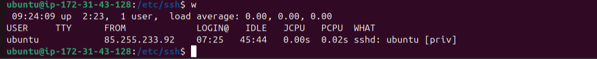
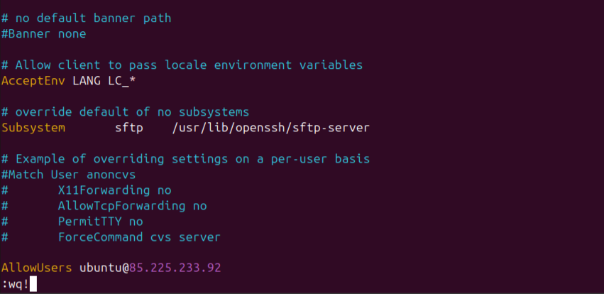
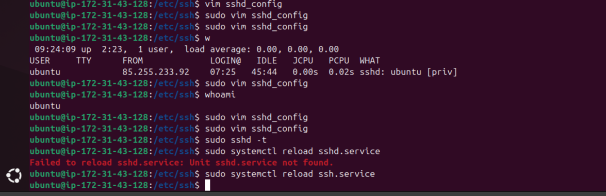

# Challenge 2B

## Task 2 : SSH Hardening

### 1. SSH must work only on port 2222

### 2. Only admin and deployer users should be allowed

### 3. Disable password login — enable key-based auth

### 4. Provide your public key for SSH

---

## 1. SSH must work only on port 2222

a. Open the SSH configuration file (`sshd_config`) using text editor vim.

 

b. Comment out the old port (#Port 22) and add the new port: Port 2222

 

Furthermore, if this is done on an Amazon EC2 instance, also make sure that during the creation/launching of the EC2 instance, you only tick the SSH port 22 box, and then you can manually change it to 2222 in the ssh configuration file like it was done here above.

### 2. Only admin and deployer users should be allowed. Implement an IP address allow list.

a. The`w`command lets you check the IP address you are using to access the server. Here the `USER` is `ubuntu` and the ip address is `FROM` `85.225.233.92`

 

 

b. Open the OpenSSH server configuration file (`sshd_config`) using the text editor vim:

 

 

c. Only allow SSH logins from users with a specific IP address and a specific name. In other words, disallow all users except for named users from specific IP addresses.

Use the `AllowUsers` configuration directive like in this example: `AllowUsers sammy@203.0.113.1 alex@203.0.113.2` , which restricts user authentications based on username and IP address. So in this case, we would be using the IP address we got from the picture above, which is `85.225.233.92` and the username `ubuntu` . Once you have finalized your configuration, add it to the bottom of your OpenSSH server configuration file

 

 

 

d. Test the configuration syntax in the  OpenSSH server’s `sshd_config file` . If there are any issues, errors will be printed.
As you can see in the screenshot below, nothing was printed.

 

 

e. The SSH service was reloaded successfully using `sudo systemctl reload ssh.service` , applying the configuration changes made to the OpenSSH server’s `sshd_config file`. On Ubuntu, the SSH daemon service is usually called ssh.service, not sshd.service. That is why sshd.service did not work as you can see in the screenshot below.

 

 
