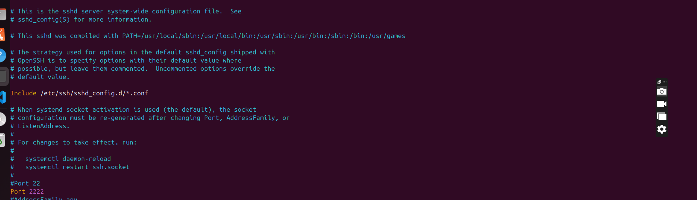

# Challenge 2B

## Task 2 : SSH Hardening

### 1. SSH must work only on port 2222

### 2. Only admin and deployer users should be allowed

### 3. Disable password login — enable key-based auth

### 4. Provide your public key for SSH

---

## 1. SSH must work only on port 2222

Open the SSH configuration file (sshd_config) using text editor vim and comment out
the old port (#Port 22) and add the new port: Port 2222

Furthermore, if this is done on an EC2 instance, also make sure that during the creation/launching of the EC2 instance, you only tick the SSH port 22 box, and then you can manually change it to 2222 in the ssh configuration file like it was done here above.
